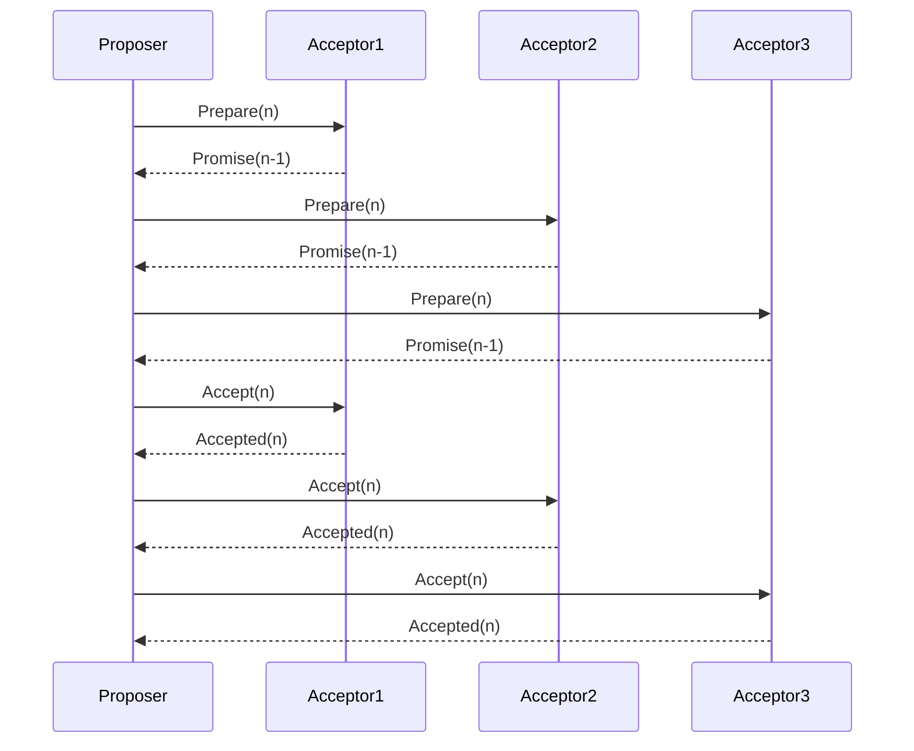

[[Paxos]] is a [[Consensus]] algorithm designed to solve the problem of reaching agreement in a distributed system. It was first introduced by [[Leslie Lamport]] in 1989. Consensus algorithms ensure that a group of nodes in a distributed system agree on a particular value or outcome.

Paxos has three main roles: proposers, acceptors, and learners. Proposers suggest values, acceptors vote for the values they accept, and learners learn the agreed-upon values. The algorithm proceeds through multiple phases, including preparation, proposal, and acceptance phases until consensus is reached.

## Visualizing the Paxos Algorithm

## Raft as a simplification of Paxos

[[Raft]] is another consensus algorithm developed by [[Diego Ongaro]] and [[John Ousterhout]] in 2013. Similar to Paxos, Raft aims to provide consensus in a distributed system but with a focus on understandability and simplicity. It divides the responsibilities into three key components: leaders, followers, and candidates.

The main difference between Paxos and Raft lies in their approach to achieving consensus. Paxos uses an asynchronous approach where messages can be delayed or lost during communication between nodes. This makes it more complex to understand and implement correctly.

On the other hand, Raft employs a more intuitive leader-based approach where all requests are processed through a single leader node. This simplifies understanding and implementation as it eliminates the need for dealing with complex message interactions.

In terms of relations, both Paxos and Raft aim to solve the same problem of achieving consensus in distributed systems. However, they differ in their design philosophy and implementation details. Raft was explicitly designed to be more understandable than Paxos while maintaining similar performance characteristics.

# Conclusion
Overall, both algorithms have had significant impact in the field of distributed systems and have been widely used as building blocks for various distributed databases and systems.