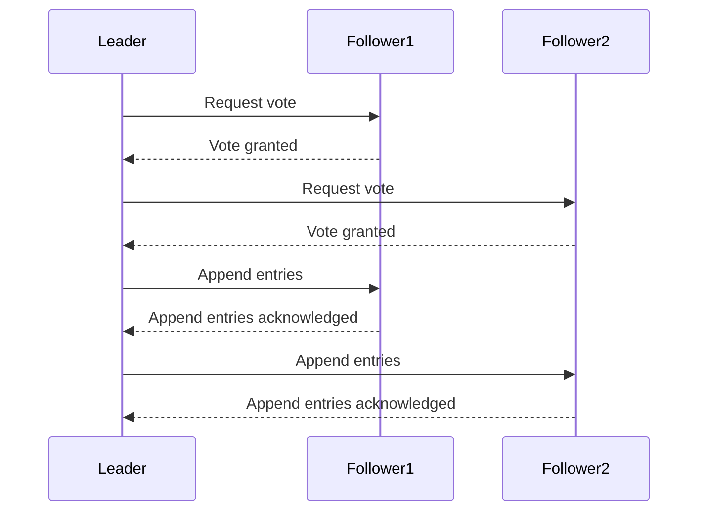

Raft is a consensus algorithm designed for managing a replicated log in a distributed system. It provides strong consistency guarantees and ensures that all nodes in the system agree on the same sequence of log entries. One of the key aspects of Raft is its ability to handle concurrent operations and synchronize them across multiple nodes.

Concurrency synchronization in Raft is achieved through a leader-based approach. In a Raft cluster, one node is elected as the leader, and it becomes responsible for coordinating all operations performed by the cluster. The leader receives client requests and appends them to its own log, then it replicates these entries to other nodes in the cluster.

To ensure synchronization, Raft uses a combination of mechanisms such as leader election, log replication, and commit consistency checks. When a client sends a request to the leader, it appends the request to its own log as an uncommitted entry. The leader then broadcasts this entry to other nodes in the cluster for replication.

Once a majority of nodes have replicated the entry and sent an acknowledgment back to the leader, it considers the entry committed. At this point, the leader notifies all nodes about this commitment, allowing them to apply the operation locally. This process ensures that all nodes eventually execute operations in the same order.
## A sequence diagram for Raft

Raft also handles situations where multiple leaders can potentially emerge due to network partitions or failures. In such cases, only one valid leader can exist at any given time according to certain election rules defined by Raft. The algorithm allows for new leaders to be elected if needed through an election process involving voting from other nodes.

## Raft and Paxos

[[Raft]] and [[Paxos]] are both consensus algorithms developed for managing replicated state machines in distributed systems. They both aim to ensure consistency and fault tolerance in distributed systems, but they approach the problem in different ways.

Raft is a consensus algorithm that was designed to be more understandable than Paxos. It focuses on providing a simple and intuitive solution for achieving consensus in a distributed system. Raft divides the consensus problem into three key components: leader election, log replication, and safety.

In Raft, the system is divided into several nodes, and one node is elected as the leader. The leader is responsible for accepting client requests, propagating them to other nodes, and ensuring that they are replicated on a majority of nodes before committing them to the state machine. Raft guarantees safety by using an elected leader to coordinate log replication and enforcing a strong consistency model.

Paxos, on the other hand, is an older consensus algorithm that has been widely studied and used in various systems. It offers a more complex solution compared to Raft but provides stronger guarantees under certain conditions.

Paxos operates through a sequence of rounds or ballots where nodes propose values and agree on a single value through multiple phases. It uses voting-based protocols to ensure agreement among nodes while tolerating failures such as node crashes or message loss. Paxos can handle situations where multiple leaders may exist simultaneously due to network partitions or failures.

While both Raft and Paxos aim to achieve consensus, their approaches differ in terms of complexity, ease of implementation, understandability, and their specific trade-offs. Raft emphasizes ease of understanding for developers while still offering strong consistency guarantees. On the other hand, Paxos provides more robustness against failure scenarios but can be more challenging to implement correctly.

Overall, both algorithms have made significant contributions to the field of distributed systems by providing practical solutions for achieving consensus in different contexts.

# Conclusion
Overall, Raft provides a robust mechanism for concurrency synchronization in distributed systems by electing leaders, replicating logs, and ensuring commit consistency across multiple nodes. Its simplicity and understandability make it an attractive choice for building fault-tolerant systems that require strong consistency guarantees.
