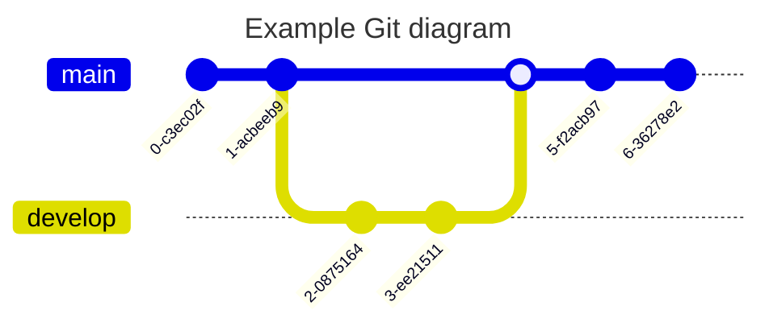

#diagramming_software

[mermaid.js](https://mermaid.js.org/) is a JavaScript-based diagramming tool that allows you to create diagrams and flowcharts using simple text-based syntax. It provides a way to describe diagrams and their elements using plain text, which is then rendered as SVG or PNG images.

Mermaid.js supports various types of diagrams, including flowcharts, sequence diagrams, Gantt charts, class diagrams, state diagrams, and entity-relationship diagrams. It uses a Markdown-like syntax to define the structure and relationships between different elements in the diagram.

Here's an example of Mermaid.js syntax to create a simple flowchart:


This code will generate a flowchart with four nodes (A, B, C, D) connected in sequential order.

Mermaid.js also allows you to customize the appearance of your diagrams by specifying styles for different elements. You can change colors, fonts, line types, and more using CSS-like syntax.
```merm
stateDiagram-v2
        direction LR
        [*] --> Still
        Still --> [*]
    
        Still --> Moving
        Moving --> Still
        Moving --> Crash
        Crash --> [*]

```


One of the key advantages of Mermaid.js is its simplicity. You don't need any complex graphical tools or software installations to create professional-looking diagrams. It can be easily integrated into web applications or used as a standalone tool.

Furthermore, Mermaid.js is open-source and actively maintained by its community. It has good documentation with examples and supports various plugins and extensions for additional functionality.

In summary, Mermaid.js is a JavaScript library that simplifies the process of creating diagrams by allowing you to define them using plain text syntax. It offers support for multiple types of diagrams and customization options while being easy to use and integrate into your projects.

# Mermaid.js may create colorful diagrams

Yes, mermaid.js can create colorful diagrams. It supports a wide range of colors and allows you to customize the color of various elements in your diagrams. You can specify colors using standard color names, hexadecimal values, or RGB values.


Mermaid can also draw diagrams in multiple sub-sections.


It can also draw Git diagram:



## For Mathematical Diagrams
To have more mathematical typesetting features, [[TikZJaX]] can be more convenient to use, since there are many existing diagrams drawn by mathematicians in [[TikZ]] syntax already. For example, many [[Category theory|category theorists]] would publish diagrams encoded in [[TikZ]] syntax.

```merm
stateDiagram-v2
        state if_state <<choice>>
        [*] --> IsPositive
        IsPositive --> if_state
        if_state --> False: if n < 0
        if_state --> True : if n >= 0

```


```merm

stateDiagram-v2
        direction LR
        [*] --> Still
        Still --> [*]
    
        Still --> Moving
        Moving --> Still
        Moving --> Crash
        Crash --> [*]

```