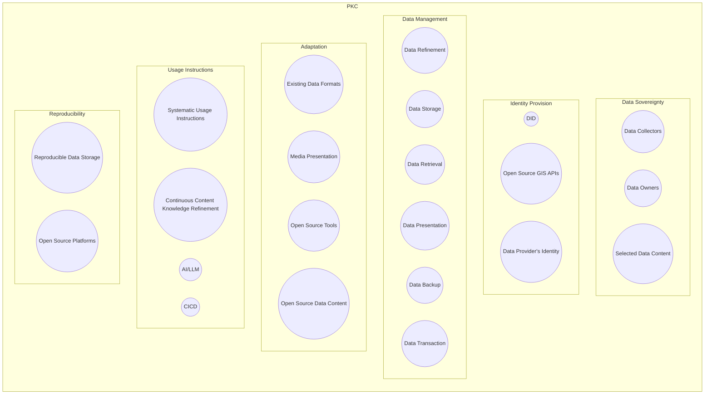
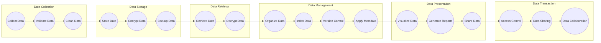

#XLP #NSM #SoG  #NAS #content_addressable 

<a href="http://pkc.pub">PKC</a> stands for [[PKC|Personal, Project, and Public Knowledge Container]], which is a way to conduct [[Personal Knowledge Management|Personal Knowledge Management]]. "PKC" is a way to help attain personalized [[Data Sovereignty]]  through [[Personal Cloud]] technologies. It is a collection of (initially Docker-based) [[Reproducible|reproducible]] microservices (computation and communication processes)that enables personalized ownership of [[Hyperlink]]-centric data assets. It is a tool designed to be operated by individuals or communities of varying sizes and can be deployed to network environments of your choice primarily using Docker-based container technologies. After the installation of "PKC", your local PKC instance will work, even without access to the Internet. PKC allows for an integrative deployment of user-friendly knowledge presentation, extensible functionalities, and self-servicing data asset ownership in a single package. In other words, this technology platform is designed to lower the entry barrier for the ownership of self-sovereign data assets.

# Functional Requirements
[[PKC]] must fulfill the following requirements:
1. Provide the means to enable [[Data Sovereignty]] in terms of enabling data collectors and owners to share selected data content without the intrusion of privacy and breach of ownership boundaries.
2. Adopt scalable [[Identity|identity provision]] technologies, such as [[DID]] and [[Open Source GIS]] APIs to associate data content correctness with the data provider's using [[Physical Meaning of Data]] and [[Social Meaning of Data|Social Meaning of Data]].
3. Enable personalized data refinement, storage, retrieval, presentation, backup, and transaction with adequate data security measures.
4. Adopt and adapt to existing data formats and media presentation capabilities using Open Source tools and Open Source data content
5. Provide systematic usage instructions and continuous content knowledge refinement process using open source tools such as [[AI]]/[[LLM|Large Language Models]], and [[CICD]].
6. Adopt a [[Reproducible]] data storage and manipulation platform using Open Source platforms, such as [[NixOS]], [[Docker]], and [[Kubernetes]].
### Usage Scenarios of PKC
[[PKC]] as a software platform is designed to be [[Scale-free]] and therefore can be applied to Personal, Project, and Public uses. This means that individuals, communities, and organizations of varying sizes. The initial use cases can be combined with [[personal knowledge management|PKM]], and organizational [[Data Asset Management|data asset]]/content management.

## Other Related Technologies and Methodologies with [[PKC]]

Once installed, PKC can function even without internet access. It offers user-friendly knowledge presentation, extensible functionalities, and self-servicing data asset ownership in a single package. The goal of PKC is to make it easier for individuals to own their self-sovereign data assets by reducing the barriers to entry. A popular implementation is [[Network Attached Storage]] ([[Network Attached Storage|NAS]]), which basically has most of the functionality of [[PKC]].

PKC was developed in context with [[XLP]] and the [[Science of Governance|SoG]]. A way to organize content knowledge can be considered to be an [[Intentional Workflow]], which can be implemented using [[Zettlekasten Workflow]]. It is also an embodiment of a [[Conscious Agency]]. Initially, it also must have many plug-ins for existing [[Personal Knowledge Management|PKM]] tools to extract data for inputs and metrics of individual users and agencies.  It needs to use [[Blockchain]], [[Smart Contract|Smart Contracts]], [[Git]], and [[IPFS]] to realize its reach.

## An architectural diagram for PKC generated by ChatGPT

Based on your notes, here is an architectural diagram using Mermaid syntax for PKC:

This diagram represents the different components and functionalities of PKC, including data sovereignty, identity provision, data management, adaptation, usage instructions, and reproducibility. Each component is represented as a subgraph with its corresponding elements.

## Process Diagram for PKC

Certainly! Here is a process diagram using Mermaid syntax that illustrates how PKC processes data:

This process diagram outlines the sequential steps involved in the data processing within PKC. It starts with data collection, followed by data validation and cleaning. The processed data is then stored, encrypted, and backed up. When needed, the data is retrieved, decrypted, and managed through organization, indexing, version control, and metadata application. The processed and managed data is presented through visualization, report generation, and data sharing. Finally, data transactions are facilitated through access control, data sharing, and collaboration.

Given the following text: "Clave pública criptográfica (PKC) es un sistema de cifrado que utiliza un par de claves, una pública y una privada, para asegurar la comunicación segura y autenticación de datos. La clave pública se comparte con otros usuarios y se utiliza para cifrar los mensajes, mientras que la clave privada se mantiene en secreto y se utiliza para descifrar los mensajes cifrados. Este método de cifrado asimétrico es ampliamente utilizado en la seguridad de las comunicaciones en línea, como el intercambio de información confidencial y la autenticación de usuarios. La PKC se basa en la dificultad de resolver ciertos problemas matemáticos, como la factorización de números grandes, lo que la hace muy segura. Es un componente esencial en la seguridad de las transacciones en línea y en la protección de la privacidad de los usuarios", please translate into Chinese.

给定以下文本：“公钥密码体制（PKC）是一种使用一对密钥（公钥和私钥）来确保安全通信和数据认证的加密系统。公钥与其他用户共享，并用于加密消息，而私钥保持秘密，并用于解密加密消息。这种非对称加密方法广泛应用于在线通信的安全性，如机密信息交换和用户身份验证。PKC基于解决某些数学问题的困难程度，如大数因子分解，因此非常安全。它是在线交易安全和用户隐私保护的重要组成部分。” 请翻译成中文。
## References

[[個人知識容器]]

[[@techcrunchAnytypeOpenEncrypted2020|Anytype as an Open and Encrypted OS]]

[[@kuznetsovSecretDoubleentryBookkeeping2019a|The Secrets of DEB: Personification of Accounts]]