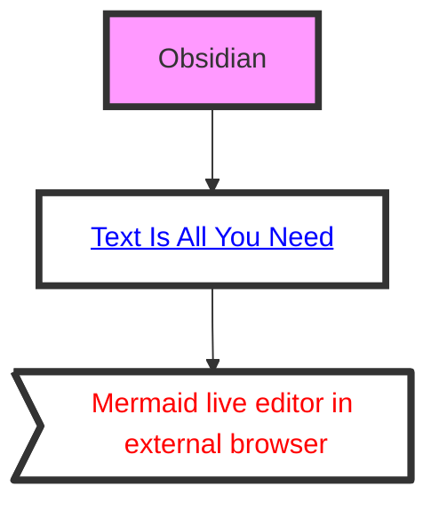

```mermaid
graph TD
	direction LR
    A[Obsidian] --> B[Text Is All You Need]
    B --> C>Mermaid live editor in external browser]
    click A "obsidian://open?vault=Homebase&file=Obsidian" "Obsidian"
    click C "https://mermaid-js.github.io/mermaid-live-editor" "Mermaid live editor"
    style A fill:#f9f,stroke:#333,stroke-width:4px,shape:roundRect
    style B fill:#fff,stroke:#333,stroke-width:4px,color:blue,text-decoration:underline
    style C fill:#fff,stroke:#333,stroke-width:4px,color:red
class A internal-link;
class B internal-link
```